# Portfolio

### Digital Design and Fabrication
### Author: Niklas Schmidt

---

## Exercise 1: Electrical Circuits
<!--suppress CheckImageSize -->
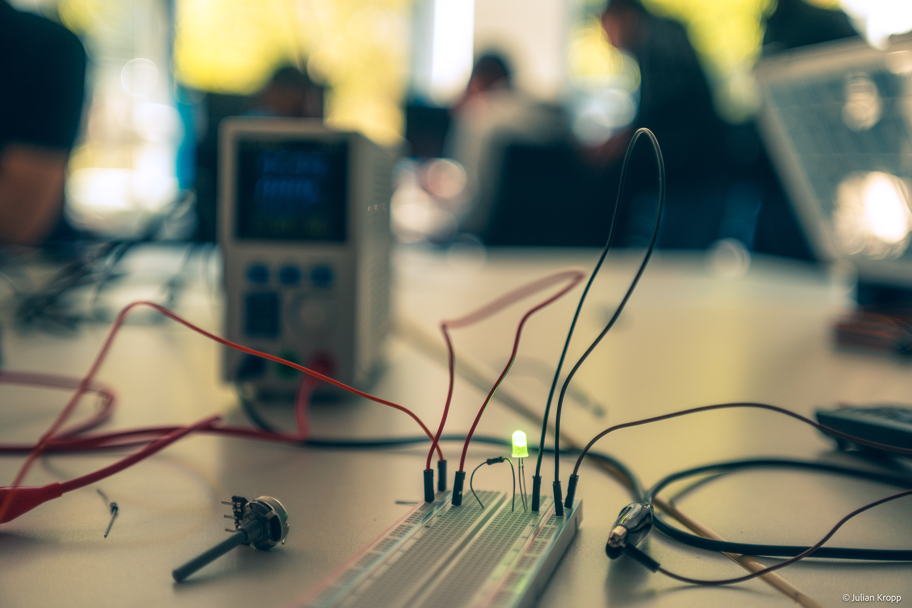

### Task 1: LED Control Circuit

#### Task 1.1: Simple LED Circuit
We observed that the larger the resistance in the circuit, the higher the voltage across the resistor V1 and the lower the voltage across the LED (VLED).

| R1 [Ω] | Measured V1 [V] | Measured V_LED [V] |
|--------|-----------------|--------------------|
| 220    | 2.0             | 2.8                |
| 1000   | 2.5             | 2.5                |
| 4700   | 2.9             | 2.2                |

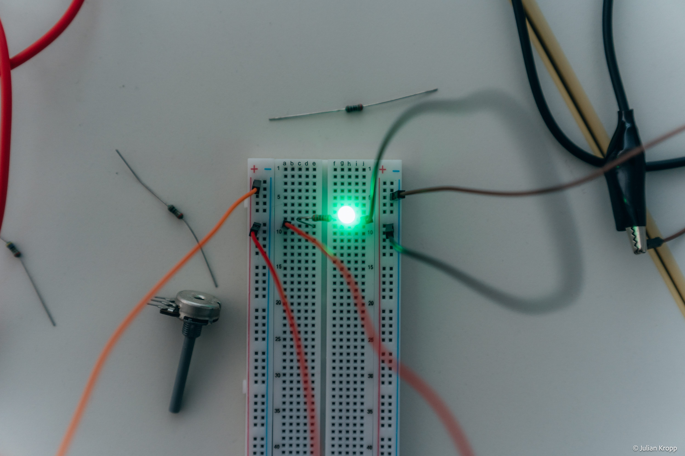

#### Task 1.2: Switchable LED Circuit
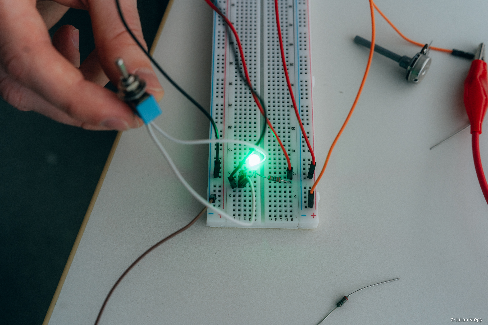

In this subtask, we observed that operating the switch turned the LED on or off. When we flipped the switch in the opposite direction, the behavior reversed: if the LED was previously off, it turned on, and vice versa.

In the following video, you can see that the switch works.

[Video of the switch](photos/01/DF-FHD_169.mp4)

#### Task 1.3: Dimmable LED Circuit
As we turned the potentiometer, the brightness increased gradually after the minimal current necessary for the LED has been reached. Then it rised quickly near the "on" threshold. The LED does not brighten linearly with knob position.

| Position | VLED [V] | V2 [V] |
|--------|-----------------|--------------------|
| a) full brightness    | 3.0             | 3.0                |
| b) dimmed  | 2.3             | 2.3                |
| c) OFF  | 2.0             | 2.0             |

### Task 2: Transistor Switch Circuit

#### Task 2.1: Switchable LED Strip
First, we recreated the circuit based on the template from the exercise sheet. Essentially, the switch simply turned the LED strip on and off.

We control 5V with the switch, which is applied to the base of the transistor. As long as this voltage is present, the transistor conducts the current supplied to the LED (12V).

The transistor acts as an electronic switch. When a positive voltage (5V) is applied to the base, the base-emitter diode becomes conductive and allows current to flow from the collector to the emitter. This enables the transistor to control the 12V current through the LED. Without base voltage, the transistor blocks and no current flows through the LED. The advantage is that a small control current at the base can switch a large load current (12V LED).

Otherwise, the implementation worked well and the result was a white glowing LED strip!

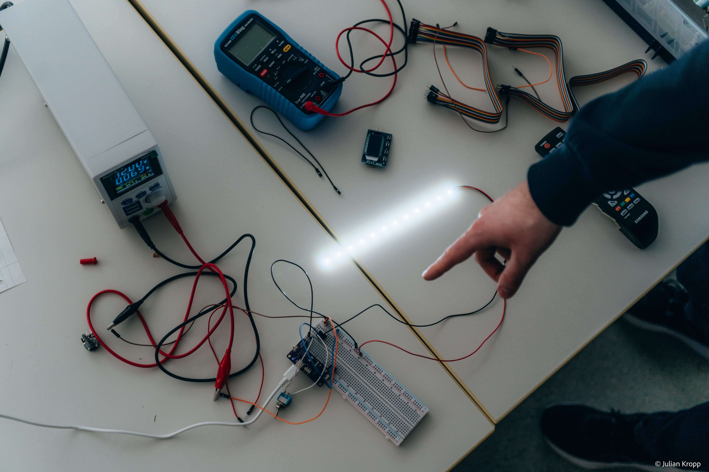

#### Task 2.2: Dimmable LED Strip
It became somewhat more complicated when we tried to implement the second subtask. The switch caused issues because the LED strip did not light up. In the end, we cannot say with 100% certainty what the problem was, but we suspect that the switch cables were damaged. However, with Mikołaj’s help, we simply removed it to proceed with the task.

In this task, we were supposed to integrate a PWM generator and measure what happens when, on the one hand, the duty cycle is changed at a constant frequency (90 Hz), and on the other hand, the frequency is changed at a constant duty cycle (50%).

When the duty cycle is increased at a constant 90 Hz, the LED strip becomes brighter. At 2%, the light is barely visible, while at 100% it is almost blinding 😉

If, on the other hand, only the frequency is changed, a varying degree of flickering can be observed. At 5 Hz, the flickering is clearly visible and slow; at 25 Hz or 45 Hz, it becomes much faster and uncomfortable for the eye. From about 60 Hz onwards, our visual system perceives the light as almost constant, although periodic pulsations still occur at higher frequencies. The flickering was still visible on camera because its frame rate was not synchronized with the switching frequency of the LED strip.

In the video, the flickering at 5 Hz can be observed.

[Video of the blinking LED-Strip](photos/01/DF2-FHD_169.mp4)

Here are the remaining photos with constant frequency and varying duty cycle:

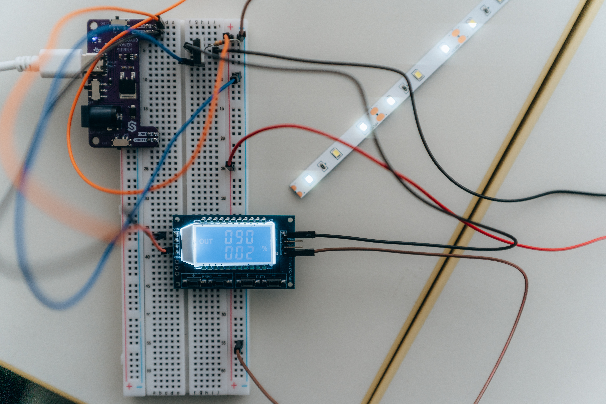
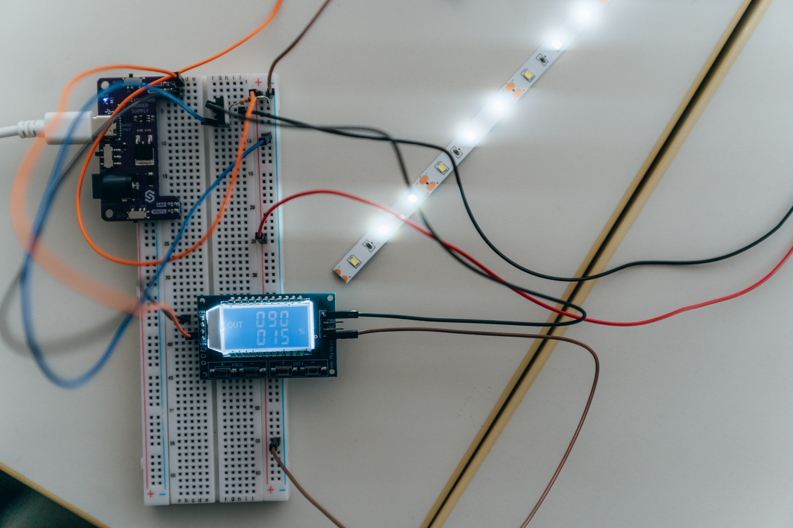
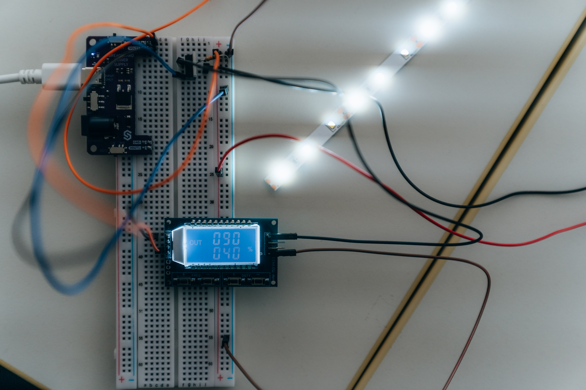
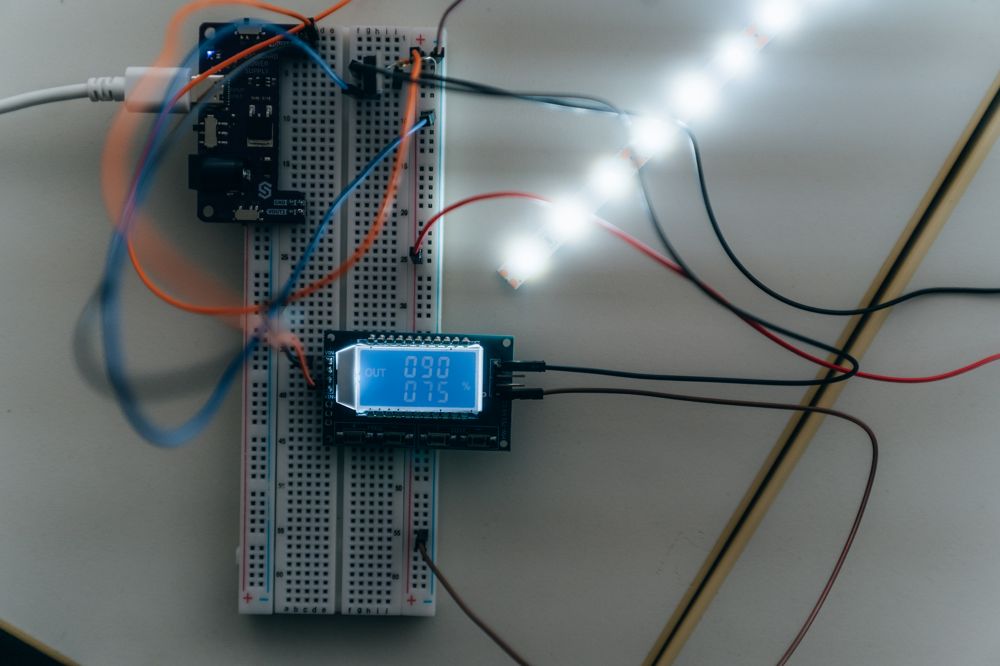
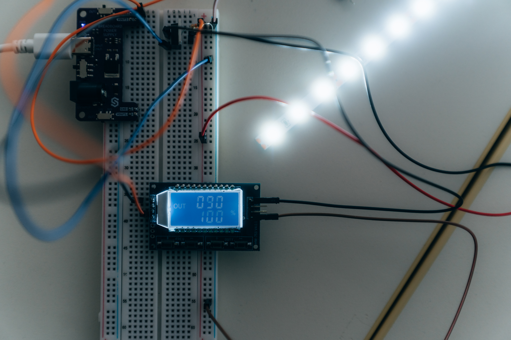

Compared to the LED you can notice that the LED-Strip was able to glow much darker thanks to the use of the PWM generator.
While the LED needed a minimal voltage / current and had therefore also a minimal brightness, the LED stip could glow darker,
because of the optical illusion caused by the PWM generator, which switched the light / current (with the transistor) off for unnoticeable time periods.

---

## Exercise 2: Introduction to Arduino

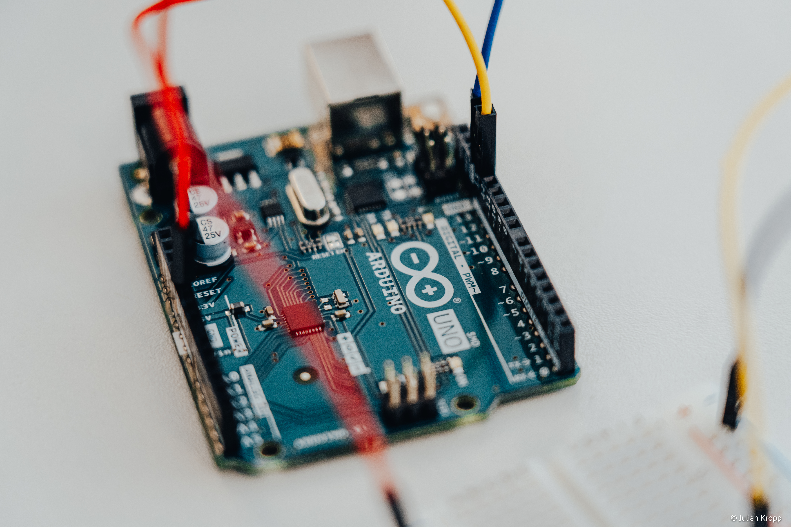

### Sub-circuit 1 - Connecting the buzzer
In this first task, we were supposed to connect a buzzer to the Arduino, run a test program on it, and modify parameters in it.

First, we placed the buzzer and a resistor on a breadboard and connected it to the Arduino. This worked without any issues.

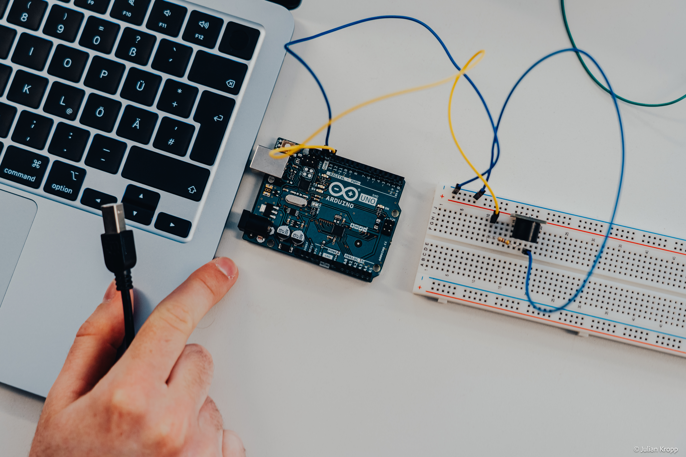

However, when uploading the test program, we got an exit status 1 compilation error.

This frustrated Julian a bit.

After some debugging, we found out that the problem was a missing library. We had to install the "Adafruit BusIO" library for the program to compile.

With both fixes, it worked then.

There was a missing delay between LOW and HIGH in the code, and the control pin had to be changed from 4 to 13. If the delay between the highs is effectively 0, we don't get three alarm tones, but a continuous one.

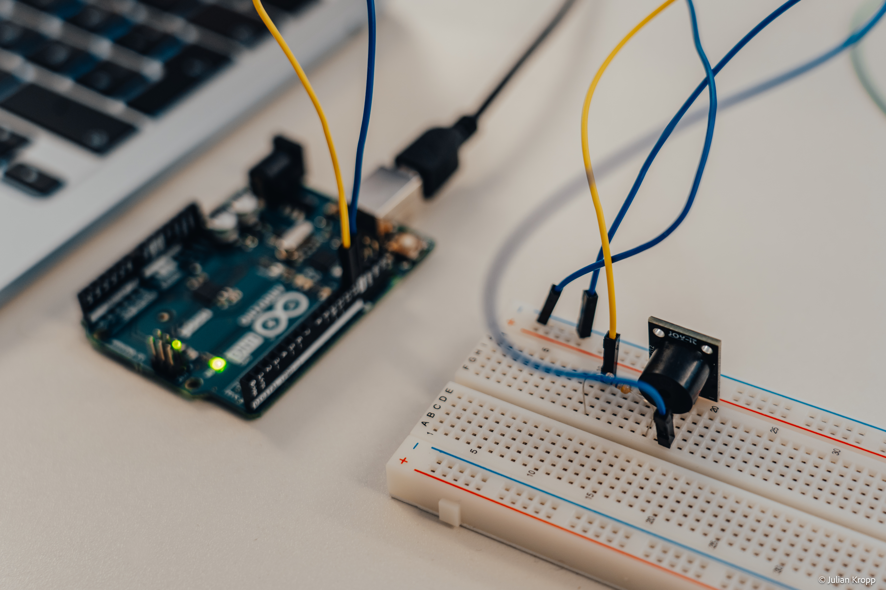

Also noteworthy: If we omit the resistor, the sound is very loud. We captured this in these two videos.

[Video of the silent buzzer with the resistor](photos/02/01-4K30.mp4)

[Video of the loud buzzer without the resistor](photos/02/02-4K30.mp4)

### Sub-circuit 2 - Connecting the LED screen

In the next subtask, an LED screen was connected to the Arduino. This worked wonderfully thanks to the clear circuit diagram. Without it, we wouldn't have intuitively understood what SCL and SDA are and where they are connected on the Arduino.

Additionally, the display's resistor had to be adjusted using a screwdriver on the back.

Using the provided test program for the display, we then found out what the I2C address of the display is. This allowed us to control it and display text in the first place.

The inscription "Whatever makes sense to show" was then successfully displayed.

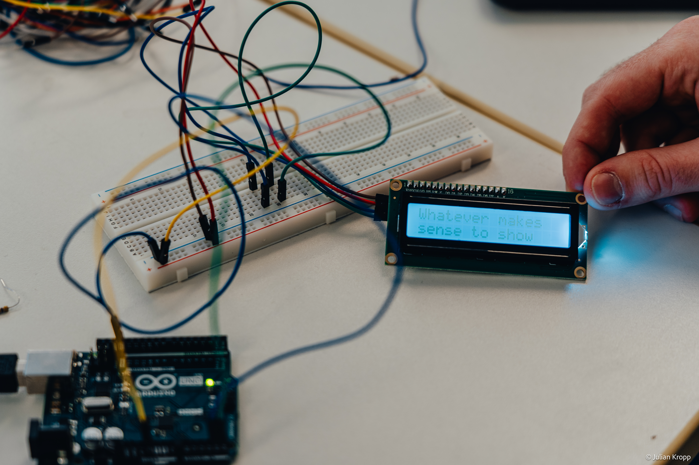

### Sub-circuit 3 - Expanding the setup with a Real Time Clock
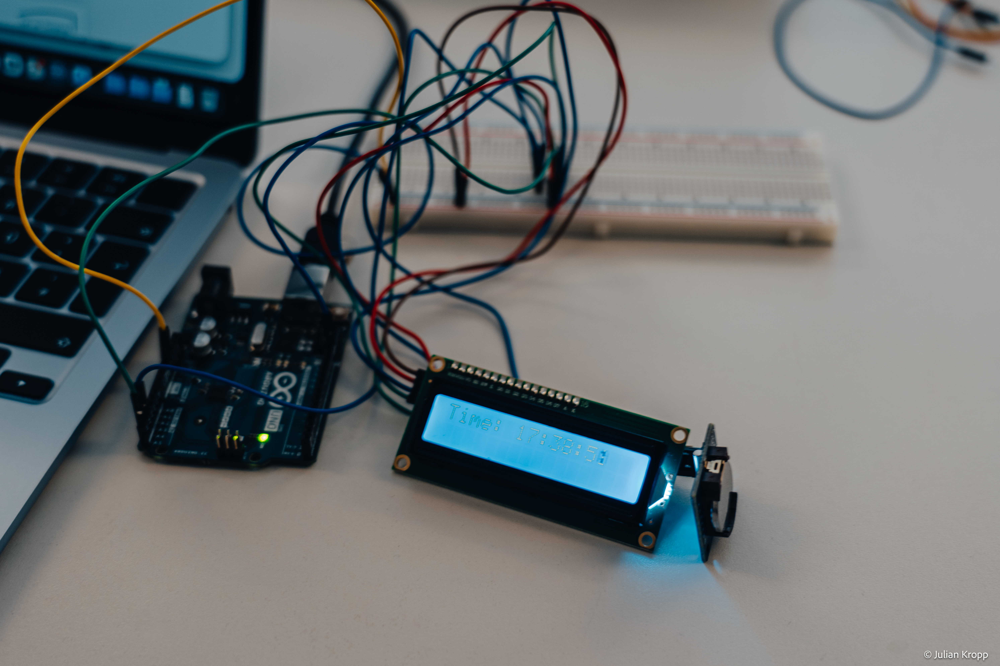

In the third subtask, we were supposed to connect an RTC module, to which a battery is attached, which keeps the time even when the Arduino is turned off. We first placed the module on the breadboard and then established the I2C connections to the Arduino. It was important to connect SDA and SCL correctly and insert the battery into the module so that the real-time clock doesn't reset during a power outage.

Subsequently, we verified that the module reliably provides the current time and that the display can later show the correct time.

In the video, you can see that thanks to the module, the seconds continue to count even when the Arduino has no power.

[Video of the RTC-Module saving the time](photos/02/03-4K30.mp4)

### Sub-circuit 4 - Using the Push Button
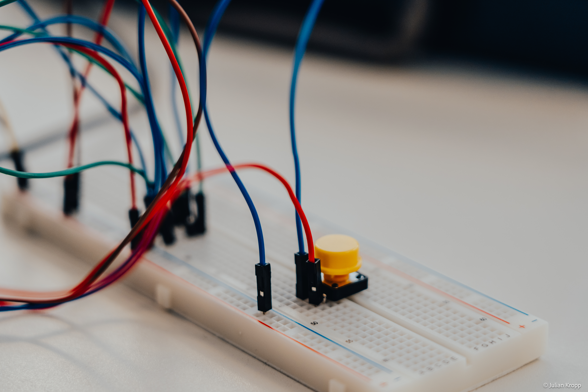

In the last subtask, we first connected one button and later several buttons to the Arduino. First, we tested a single button to ensure that the digital input signal is read correctly. Then we expanded the circuit and built in several buttons to support different functions such as alarm stop, confirmation, and menu navigation.

We made sure to use the buttons with pull-down resistors so that the input doesn't float when idle. In the program, we queried the state changes and built in short debounce times to avoid accidental multiple triggering.

This way, we could later reliably control the start/stop and time setting in the alarm project via button press.

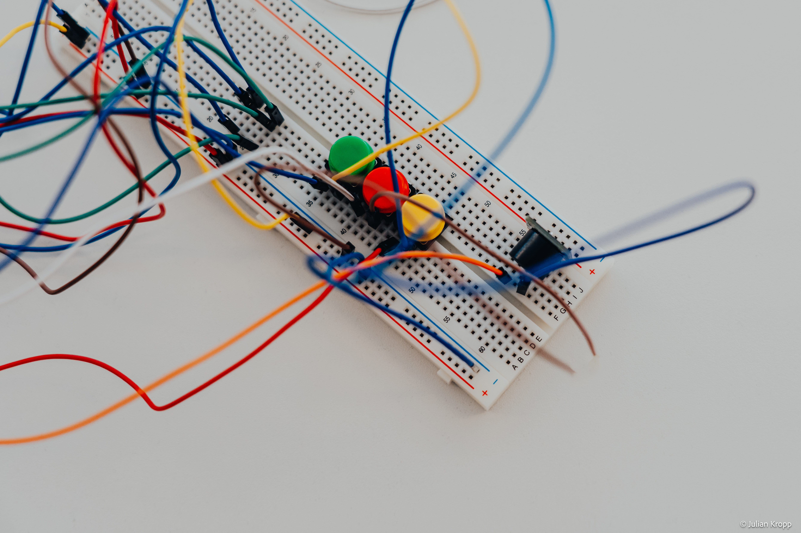

### Final task - Building the Alarm Clock

In the final step, we then built and programmed the actual alarm clock. Here, all subtasks came together, and in the end, we added our own functions and revised and improved the given code.

TODO Code improvements:
- Music library https://github.com/robsoncouto/arduino-songs
- Adaptation of the library: End with red button
-

Features:
- Display shows current time
- When the red button is pressed, you can first change the hours for the alarm (+ = green, - = yellow) and when pressed again, the minutes
- With the white button, you can turn the alarm on or off
- When the alarm goes off, the Tetris melody is played
- For better debugging, the alarm is always set to one minute later

Problems:
- The limited RAM of the Arduino did not allow playing three random melodies (Mario, Tetris, and Pink Panther). Therefore, only Tetris works. When the RAM was overloaded again, it led to the display not showing any information

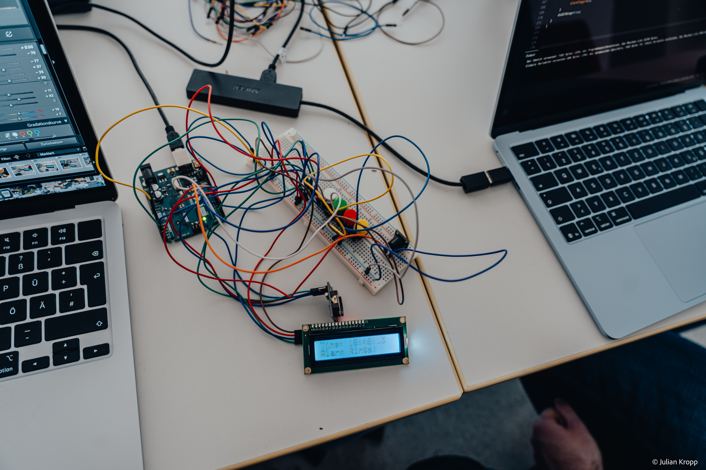

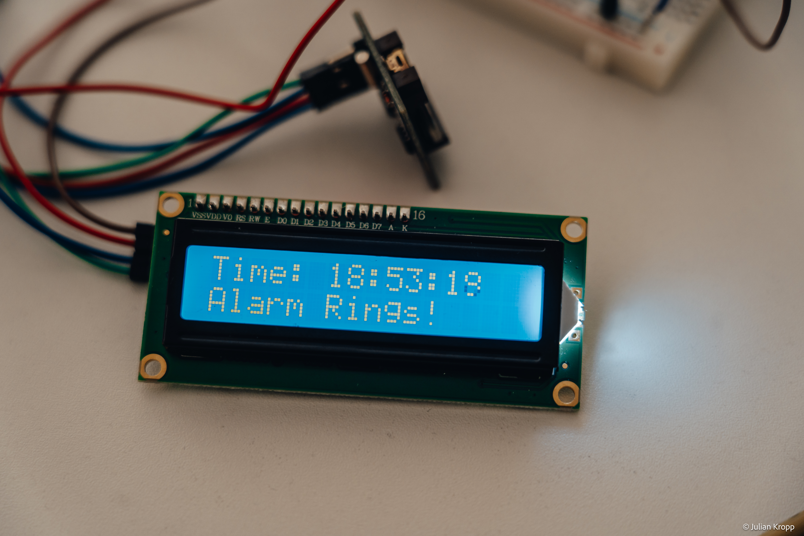

Below is a video showing the functionality of the clock.

!!!!!!  TODO: INSERT VIDEO  !!!!!!!